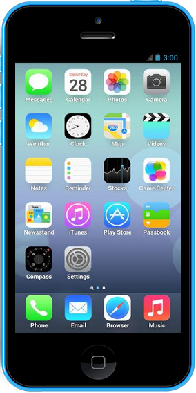
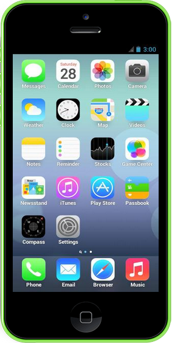
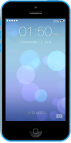

iphone-5c
=========

> A web component for adding an iPhone image to your site with the picture display of your choice.

> iPhone picture templates courtesy of [QuizUp](https://www.quizup.com/en)
 
## Demo 
[Click Here](https://yujyet.github.io/iphone-5c)

## How To 
```html
<iphone-5c src="README_file/example.png"></iphone-5c>
```


##### You can also choose between 3 different colors (red, blue, green) with blue being the default
```html
<iphone-5c src="README_file/example.png" color="red"></iphone-5c>
```
        
```html
<iphone-5c src="README_file/example.png" color="green"></iphone-5c>
```


##### You can also changes its size proportionally. 1 is 100% and .5 is 50%. 
```html
<iphone-5c src="README_file/example.png" size=".5"></iphone-5c>
```


## Installation 
```html
bower install --save iphone-5c
```
